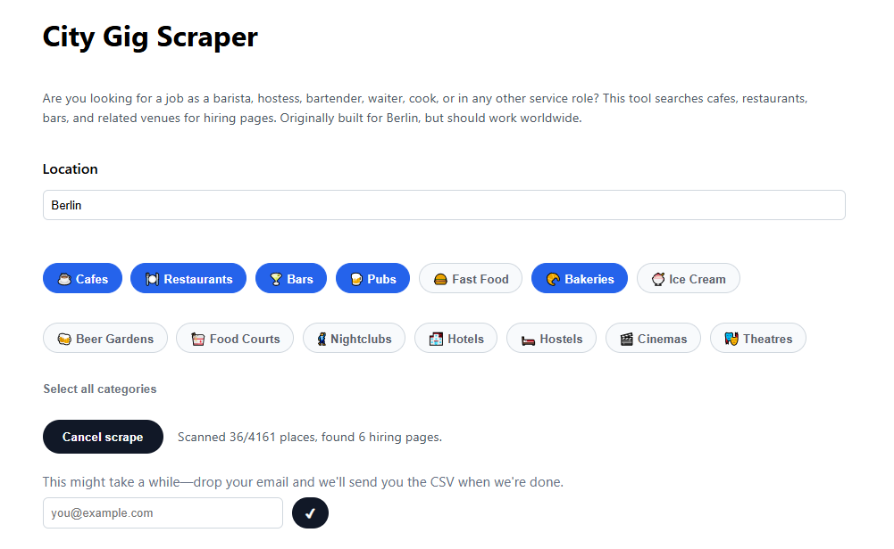
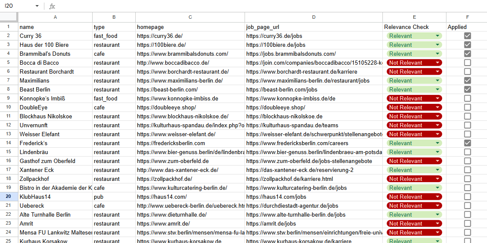

# City Gig Scraper

**Looking for service jobs in your city? This tool does the legwork for you.**



Job hunting in hospitality—cafes, restaurants, bars—is frustrating. Every place has its own website (if any), and finding their "We're hiring!" pages means clicking through dozens of sites one by one.

City Gig Scraper automates this:
1. Finds all venues of your chosen type (cafes, bars, restaurants, etc.) in your city using OpenStreetMap
2. Visits their websites and looks for job/career pages
3. Exports everything to a CSV you can open in Excel or Google Sheets

Now you have one list to review, filter, and work through systematically.



---

## 🌐 Use the hosted version (easiest)

**[city-gig-scraper.onrender.com](https://city-gig-scraper.onrender.com)**

No setup required. Just:
1. Enter your city (e.g., Berlin, New York, Madrid)
2. Pick categories (Cafes, Restaurants, Bars, etc.)
3. Click "Run scrape"
4. Download your CSV when ready

### Optional: Get results via email

The hosted version is a bit slower since it's shared. Drop in your email address and we'll send you a download link when your CSV is ready (usually takes a few minutes).

**Privacy**: Nothing is saved. No database, no tracking. CSV files are deleted after 1 hour (or 24 hours if you use email). We only keep your email in memory until the job finishes.

**Speed**: Hosting is slower than running it yourself. We have limits as to how much we can scrape at one moment. There is a queue, but if you're in a rush or want to scrape several large cities, run it locally.

---

## 💻 Run it yourself (faster, full control)

Want faster results or to run large searches? You can run the scraper on your own computer. It's a Python script—no server needed.

### Prerequisites

- Python 3.8 or newer ([download here](https://www.python.org/downloads/))
- Basic command line familiarity (but we'll walk you through it)

### Setup (one time)

**Windows:**

Open PowerShell in the project folder and run:

```powershell
python -m venv .venv
.venv\Scripts\Activate.ps1
pip install -r requirements.txt
```

**Mac/Linux:**

Open Terminal in the project folder and run:

```bash
python3 -m venv .venv
source .venv/bin/activate
pip install -r requirements.txt
```

### Running a scrape

**Windows example:**

```powershell
.venv\Scripts\Activate.ps1
python -m job_scraper.main `
  --area "Berlin" `
  --output "my_berlin_jobs.csv" `
  --user-agent "JobHunter/1.0 (+mailto:your.email@example.com)"
```

**Mac/Linux example:**

```bash
source .venv/bin/activate
python -m job_scraper.main \
  --area "Berlin" \
  --output "my_berlin_jobs.csv" \
  --user-agent "JobHunter/1.0 (+mailto:your.email@example.com)"
```

Results will be saved to `my_berlin_jobs.csv` in the same folder.

### Important flags

| Flag | What it does | Example |
|------|--------------|---------|
| `--area` | City or district to search | `--area "Munich"` |
| `--output` | Where to save the CSV | `--output "results.csv"` |
| `--user-agent` | Identifies you to websites (include your email) | `--user-agent "MyBot/1.0 (+mailto:me@example.com)"` |
| `--amenities` | Types of places to search (comma-separated) | `--amenities "cafe,bar"` |
| `--concurrency` | How many sites to check at once (5–18 recommended) | `--concurrency 15` |
| `--max-job-links` | Max job pages to find per venue | `--max-job-links 10` |
| `--limit` | Stop after N venues (useful for testing) | `--limit 50` |
| `--split-into-districts` | Break large cities into smaller areas (avoids timeouts) | Just add the flag |

**Default amenities** (if you don't specify): `cafe,restaurant,bar,pub,fast_food,bakery,ice_cream,biergarten,food_court`

### More examples

**Only cafes in Madrid:**

```powershell
python -m job_scraper.main --area "Madrid" --amenities cafe --output madrid_cafes.csv --user-agent "YourName/1.0 (+mailto:you@example.com)"
```

**All hospitality venues in New York (with district splitting for large areas):**

```powershell
python -m job_scraper.main `
  --area "New York" `
  --split-into-districts `
  --output nyc_all.csv `
  --user-agent "YourName/1.0 (+mailto:you@example.com)" `
  --concurrency 18
```

**Bars and restaurants only in Munich:**

```powershell
python -m job_scraper.main --area "Munich" --amenities bar,restaurant --output munich_bars_restaurants.csv --user-agent "YourName/1.0 (+mailto:you@example.com)"
```

### Tips

- **City names**: Use the English name OpenStreetMap knows. Try "Frankfurt am Main" instead of just "Frankfurt."
- **Large cities**: Add `--split-into-districts` to avoid timeouts (Berlin, London, Paris, etc.)
- **Testing**: Use `--limit 20` to scrape just 20 venues and see how it works
- **Be polite**: Keep `--concurrency` reasonable (5–18) and always include your contact in `--user-agent`

---

## 📊 Understanding the output

Your CSV will have these columns:

- **name**: Venue name
- **type**: Type of place (cafe, restaurant, bar, etc.)
- **homepage**: Their website
- **job_page_url**: Link to their hiring/career page (if found)

**Heads up**: There will be some false positives. Before applying, quickly check that the job page is real and relevant. I usually:
1. Open the CSV in Excel/Sheets
2. Add a "relevant?" column and mark yes/no as I scan through
3. Filter to "yes" and start applying

### Importing to Google Sheets

1. Open your CSV in a text editor and copy everything
2. Paste into cell A1 in a new Google Sheet
3. Go to **Data → Split text to columns**

---

## 🛠 Work in progress

This tool was built for Berlin but should work for most cities with good OpenStreetMap coverage. It might be buggy or miss some venues/pages—that's normal for heuristic detection.

**Found a bug or have a suggestion?** [Open an issue](../../issues) on GitHub. Pull requests welcome!

---

## 📜 License

MIT License – use it, modify it, share it. See [LICENSE](LICENSE) for details.

---

## How it works

1. **Discovery**: Queries OpenStreetMap's Overpass API for venues matching your criteria
2. **Crawling**: Politely visits each website (respects robots.txt, rate limits)
3. **Detection**: Looks for job/career pages using keywords, URL patterns, and common hiring platforms
4. **Export**: Saves everything to CSV

Built with Python, httpx (async), FastAPI (web UI), and OpenStreetMap data.
